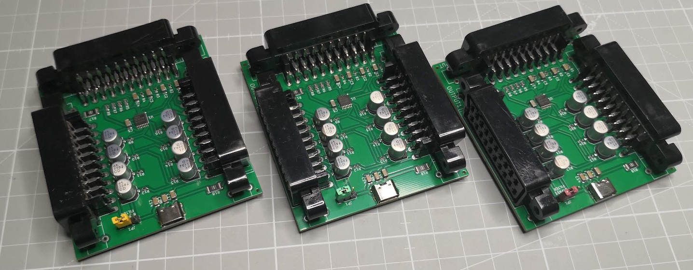

# Duplicanator™ the Scart Duplicator

## Table of contents

- [What's this?](#whats-this)
- [Schematics](#schematics)
- [Installation](#installation)
- [How to use](#how-to-use)

What's this? 
============

## This is the most wanted device for retro livestream
This is a simple PCB using the default Texas Instruments
reference design on the THS7374 Video Amp IC, this video
amp has the option to duplicate the input into 2 different
outputs, in this case as we're on EU we use the scart
connector as this is the defacto standard here for rgb video
on all the TVs.

This board was done on a livestream so little time was spent
on this PCB, you can improve it all you want, it's free.

As this is a MIT License project if you want to use it to
create another design you only have to contact me at kabukiflux
at/in gmail dot com.

## Why
Sometimes a retrogamer wants to show on the capture card the
same image as on his CRT monitor/tv so this is the cheapest
way to do it duplicating the analog RGB signal.
Another use case is when you want to use multiple CRTs to play
Light Gun games with 2 players on a different set each.

This PCB was designed during a live event on:
Twitch https://www.twitch.tv/kabukiflux

# Schematics

[THS7374 I2C chip manual](https://www.ti.com/lit/ds/symlink/ths7374.pdf)

## Errors

- Audio is not processed
- The switching voltage is generated by the source device

# Installation
You need to provide a 5v USBC power supply and at least
have 2 scart cables for the output, there is no LED to show if the device
is powered so you have to believe it. xD

A good PSU is recommended as the bad ones can create interference or
audio issues.

# How to use
Easy

1- Connect the output 1 and output 2 to the devices you want to connect

2- Connect the input to your console/device to replicate RGB

3- Power via USB-C with 5V

4- Enjoy

I'm not responsible
============
And yes, read below, no responsability taken on bad use.

DISCLAIMER (MIT Licensing)
==========================
Permission to use, copy, modify, and distribute this software for any
purpose with or without fee is hereby granted, provided that the above
copyright notice and this permission notice appear in all copies.

The software is provided "as is" and the author disclaims all warranties
with regard to this software including all implied warranties of
merchantability and fitness. In no event shall the author be liable for
any special, direct, indirect, or consequential damages or any damages
whatsoever resulting from loss of use, data or profits, whether in an
action of contract, negligence or other tortious action, arising out of
or in connection with the use or performance of this software.
